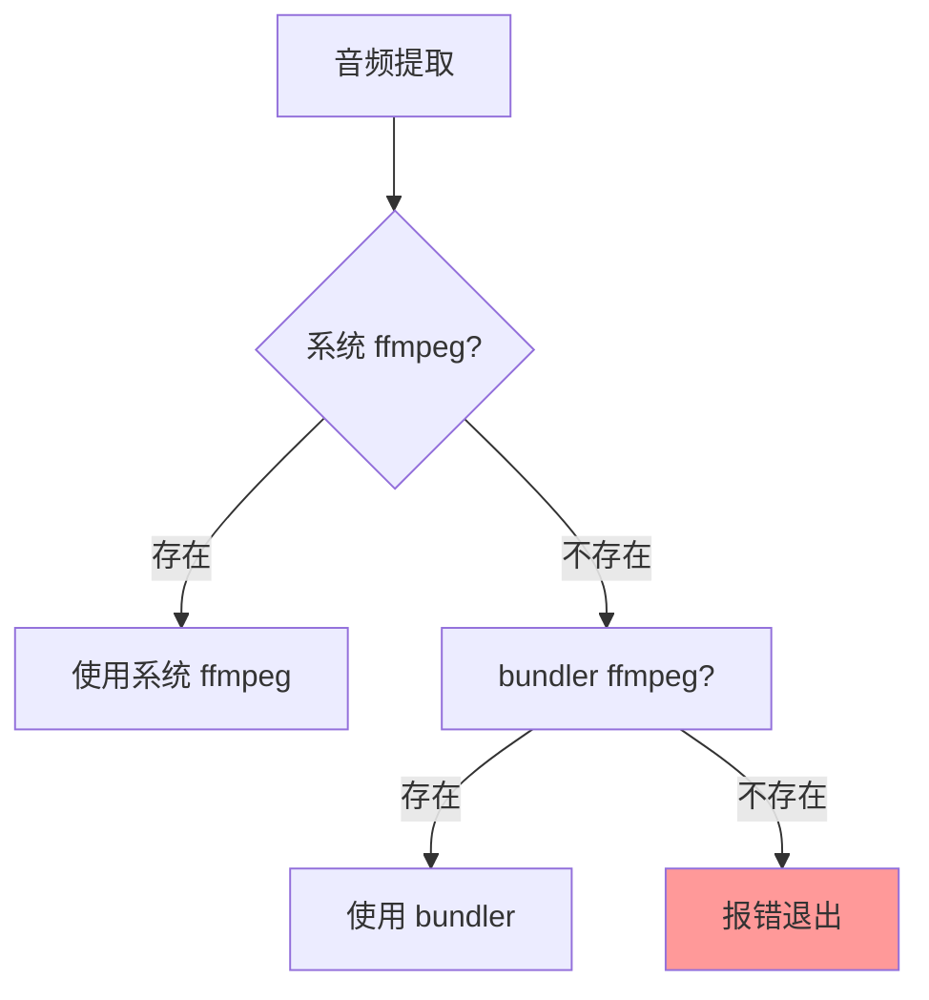
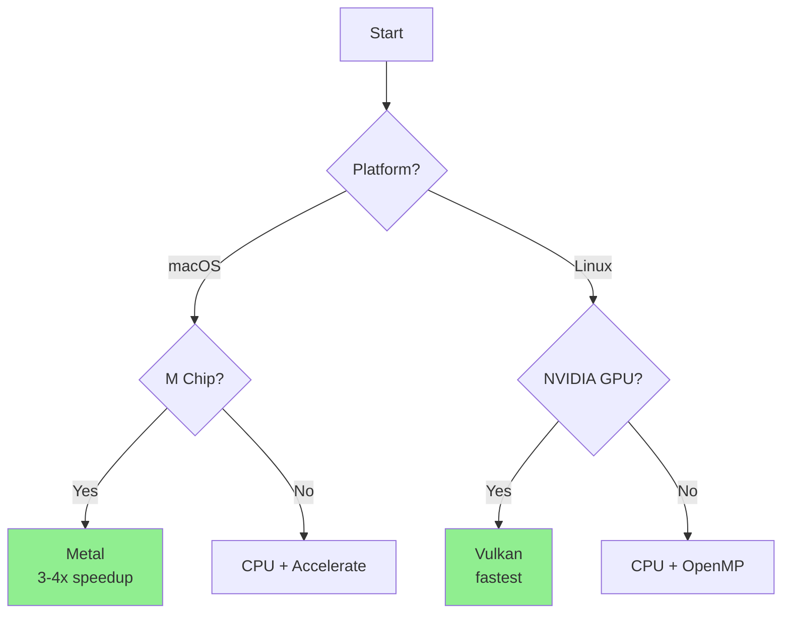
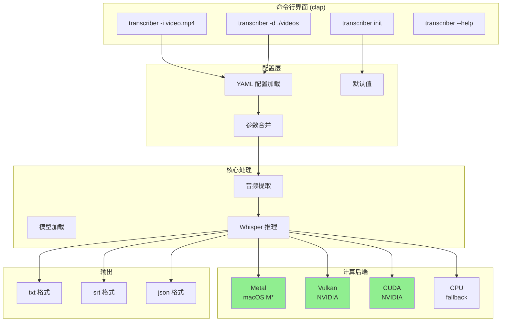
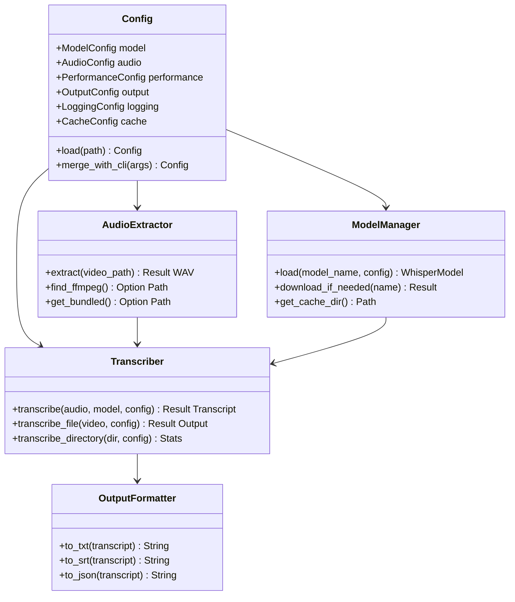

## Context

当前 `douyin/cli/transcribe.py` 是 Python 实现的视频转录工具，存在以下问题：
- Python GIL 限制了真正的并行处理
- GPU 加速依赖 `faster-whisper`，在非 NVIDIA 平台优化有限
- 跨平台构建和分发复杂

## Goals / Non-Goals

**Goals:**
- 独立的 Rust CLI 工具，开箱即用
- 跨平台支持 (macOS/Linux)，自动检测并利用 GPU
- YAML 配置文件支持所有参数自定义
- 高性能转录（接近 whisper.cpp 原生性能）

**Non-Goals:**
- 不支持流式转录
- 不支持数据库集成
- 不支持加密/敏感信息存储

## Decisions

### 1. 使用 whisper-rs 而非直接绑定 whisper.cpp

**选择:** `whisper-rs` v0.16

**理由:**
- 活跃维护 (26 releases, 170K+ 下载/季度)
- 自动检测并启用 GPU 后端 (Metal/CUDA/Vulkan)
- 完善的 Rust 生态集成 (tokio, clap, anyhow)
- 相比 whisper-cpp-plus 更成熟稳定

**备选考虑:**
- `whisper-cpp-plus`: 新兴项目，支持流式/VAD，但生态不成熟
- 直接 FFI: 需要自行处理编译和链接，复杂度高

### 2. 配置格式使用 YAML

```yaml
model:
  name: base
  language: zh
  quantization: q5_k

audio:
  sample_rate: 16000
  channels: 1

performance:
  threads: 0  # 0 = auto
  gpu: auto    # auto/metal/cuda/vulkan/cpu

output:
  formats: ["txt"]
  directory: "./"
  skip_existing: true

logging:
  level: "info"
  file: ""
  colors: true

cache:
  directory: "~/.cache/transcriber"
```

**理由:**
- 用户要求 YAML 格式
- 语义清晰，嵌套结构友好
- serde_yaml 成熟稳定

### 3. 配置路径使用 XDG 标准

- 配置: `~/.config/transcriber/config.yaml`
- 缓存: `~/.cache/transcriber/`

**理由:**
- 遵循 XDG Base Directory 规范
- 用户要求使用用户目录
- 支持 `transcriber init` 生成默认配置

### 4. 参数优先级


**理由:**
- 灵活使用：默认配置文件 + CLI 快速覆盖
- 符合 CLI 工具常见模式

### 5. 音频提取策略



**理由:**
- 优先使用系统已有 ffmpeg，减少依赖
- bundler fallback 确保开箱即用
- 不采用纯 Rust 实现（复杂度高，格式支持有限）

### 6. GPU 后端自动选择



**理由:**
- 自动检测最佳后端
- Metal 在 M 芯片上表现优异
- Vulkan 在 NVIDIA 上比 CUDA 更快（93s vs 126s on RTX 4070）

### 7. 输出格式设计

| 格式 | 内容 | 用途 |
|------|------|------|
| txt | 纯文本，逐行 | 简单查看 |
| srt | 字幕格式，含时间戳 | 视频字幕 |
| json | 结构化数据，含词级时间 | 程序处理 |

**理由:**
- 三种格式覆盖主要使用场景
- JSON 包含 word-level timing，便于后续处理

## Risks / Trade-offs

| 风险 | 缓解措施 |
|------|----------|
| whisper-rs 编译耗时 | 提供预编译二进制分发 |
| 模型下载慢/失败 | 重试机制 + 进度显示 |
| FFmpeg 缺失 | 清晰的错误提示 + 安装指引 |
| 跨平台 GPU 后端复杂性 | whisper-rs 统一抽象，自动选择 |
| 配置文件格式升级 | 向后兼容设计 + 文档说明 |

## Architecture

### 整体架构



### 项目结构

```
transcriber/
├── Cargo.toml
├── src/
│   ├── main.rs              # CLI 入口
│   ├── cli.rs               # clap 命令定义
│   ├── config.rs            # 配置加载和校验
│   ├── model.rs             # 模型管理
│   ├── audio.rs             # 音频提取
│   ├── transcription.rs     # 核心转录逻辑
│   ├── output.rs            # 输出格式化
│   └── error.rs             # 错误类型
├── config.yaml.example      # 配置示例
└── tests/
    └── integration.rs       # 集成测试
```

### 核心模块



## Open Questions

1. **模型量化默认值**: 推荐 Q5_K 还是保持完整 F16？
2. **bundler ffmpeg**: 是否需要打包？还是仅依赖系统安装？
3. **进度条详细程度**: 实时显示 wpm 还是仅百分比？